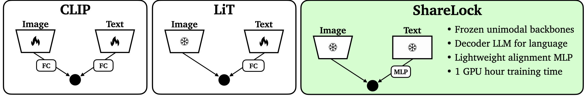

# ShareLock: Ultra-Lightweight CLIP-like Vision-Language Model

[](https://arxiv.org/abs/2410.07173)
[]([jonaruthardt.github.io/projects/ShareLock/](https://jonaruthardt.github.io/projects/ShareLock/))
[](LICENSE)
[](https://www.python.org/downloads/)

This repository provides the official implementation of *ShareLock*, an ultra-lightweight CLIP-like vision-language model, introduced in the paper:  
**"Better Language Models Exhibit Higher Visual Alignment"**  
*[Jona Ruthardt](https://jonaruthardt.github.io/), [Gertjan J. Burghouts](https://gertjanburghouts.github.io), [Serge Belongie](https://sergebelongie.github.io/), [Yuki M. Asano](yukimasano.github.io/)*  
Published in **Transactions on Machine Learning Research (TMLR) 01/2026**

📄 **[Read the Paper on arXiv](https://arxiv.org/pdf/2410.07173)**  
🤗 **[Model Checkpoints on Hugging Face](https://huggingface.co/FunAILab/ShareLock)**  
🌐 **[More Information on our Project Page](https://jonaruthardt.github.io/projects/ShareLock/)**  

---

## 🧪 Overview



**ShareLock** is a straightforward and efficient approach to building vision-language models. By leveraging frozen features from strong unimodal vision and language models, it achieves competitive multimodal performance with minimal computational resources. Key highlights include:  

- **Data Efficiency**: Trained on just 563k image-caption pairs, ShareLock achieves 51% zero-shot accuracy on ImageNet.  
- **Cost Efficiency**: Training requires only 1 GPU hour (10 hours including feature precomputation).  
- **Competitive Results**: Outperforms existing models in low-data regimes while maintaining scalability.

---

## 🚀 Features

- **Ultra-Lightweight:** Minimal training time with competitive results.
- **Pretrained Backbone:** Leverages strong, frozen unimodal features.
- **Low Resource Requirement:** Trainable with only one GPU in hours.
- **Zero-Shot Capabilities:** Effective on ImageNet and beyond.
- **CLIP-like VLM:** apply common refinement techniques (e.g., prompt tuning, LLM-based descriptions, etc.)

---

## 🛠️ Installation

1. **Clone the Repository**:
    ```bash
    git clone https://github.com/JonaRuthardt/ShareLock.git
    cd ShareLock
    ```

2. **Set up a Python Environment**:
    ```bash
    python -m venv env
    source env/bin/activate  # On Windows: env\Scripts\activate
    ```

3. **Install Dependencies**:
    ```bash
    pip install -r requirements.txt
    ```

---

## 📦 Usage

0. **Download Datasets**:
    Training and validation of the model requires the presence of paired image-caption data. Popular small-scale datasets include CC3M, CC12M and YFCC15M and can be downlaoded in webdataset format using the [img2dataset](https://github.com/rom1504/img2dataset/) library.

1. **Precompute Features**:
    Use pretrained models to extract vision and text embeddings:
    ```bash
    python precompute_image_features_hf.py # Hugginface datasets for classification tasks (test of final model)
    python precompute_image_features_hf.py # Image-caption datasets in webdataset format (training and validation)
    python precompute_language_features.py # JSON file containing caption for each uid in image dataset
    ```
    The dataset and backbone model to be used can be configured in the respective files via command line arguments. The precomputed features will be stored via the FeatureUtils library. The presence of a json file with iamge *uids* as keys and the corresponding captions as values is assumed. This information is consequently read and processed by the `precompute_language_features.py` script. 

2. **Train the Projection Network**:
    The image and text features are aligned by running:
    ```bash
    python train.py
    ```
    Settings and hyperparameters can be specified or changed in ```configs/default_config.yaml```.

3. **Evaluate Model on VLM Taks**:
    The ShareLock class implements the ```encode_text``` and ```encode_image``` functions which can be used for inference on downstream vision-language modeling tasks.

---

## 📂 Pretrained Model Checkpoints

We provide pretrained checkpoints for ShareLock on Hugging Face for easy integration and experimentation:

- **ShareLock (CC3M-trained):** [](https://huggingface.co/FunAILab/ShareLock/blob/main/ShareLock-CC3M.ckpt)
- **ShareLock (CC12M-trained):** [](https://huggingface.co/FunAILab/ShareLock/blob/main/ShareLock-CC12M.ckpt)

You can load these models directly using the `ShareLock` class:
```python
from sharelock.models.model import ShareLock

model = ShareLock.load_from_checkpoint("path/to/checkpoint.ckpt", config=config)

```
Alternatively, the `--checkpoint` flag can be passed to the `train.py` file. 

---

## 📊 Results

Our reported results were obtained via the [CLIP-Benchmark](https://github.com/LAION-AI/CLIP_benchmark/tree/main) codebase. A subset of classification results in presented in the following table:

**Zero-shot classification on ImageNet variants:**

| Model         | Dataset        | IN-1k | IN-R  | IN-A  |
|---------------|----------------|-------|-------|-------|
| [CLIP](https://arxiv.org/abs/2103.00020)          | CC3M           | 16.0% | 17.6% | 3.6%  |
| [LiT](https://arxiv.org/abs/2111.07991)           | CC3M           | 46.8% | 72.8% | 59.4% |
| [**ShareLock**](https://arxiv.org/abs/2410.07173) | CC3M           | **54.5%** | **74.7%** | **65.9%** |
| [CLIP](https://arxiv.org/abs/2103.00020)          | CC12M           | 41.6% | 52.6% | 3.6%  |
| [LiT](https://arxiv.org/abs/2111.07991)           | CC12M           | 59.9% | **79.9%** | 68.2% |
| [**ShareLock**](https://arxiv.org/abs/2410.07173) | CC12M           | **62.0%** | 78.5% | **70.1%** |

For a comprehensive and detailed evaluation of ShareLock across various vision-language-modelling tasks, see [our paper](https://arxiv.org/pdf/2410.07173).

---

## 📜 Citation

If you use this work, please cite:

```bibtex
@article{ruthardt2024sharelock,
  title={Better Language Models Exhibit Higher Visual Alignment},
  author={Jona Ruthardt and Gertjan J. Burghouts and Serge Belongie and Yuki M. Asano},
  journal={Transactions on Machine Learning Research (TMLR)},
  year={2026}
}
```

## 📧 Contact

For any questions or collaborations, contact [Jona Ruthardt](mailto:jona@ruthardt.de).

---

📄 License

This project is licensed under the MIT License. See the [LICENSE](LICENSE) file for details.
